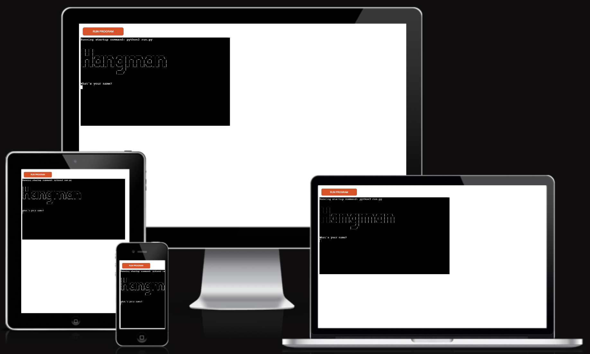

# HANGMAN

Hangman is a Python based game played in the terminal.

The live website can be found [here](https://pp3-charlie-hangman.herokuapp.com/).

## How to play
1. The computer chooses a random word and displays a series of dashes on the screen to represent each letter of the word.
2. The player then guesses a letter that they think might be in the word.
3. If the guessed letter is in the word, the computer replaces the appropriate dash(es) with that letter. If the letter is not in the word, the computer keeps track of the wrong guesses and displays a part of the hangman figure.
4. The player continues to guess letters until they either guess the word correctly or they have made six incorrect guesses, causing the hangman figure to be completed and the game to be over.
5. If the player guesses the word correctly before the hangman is completed, they win the game. If the hangman figure is completed before the player guesses the word, they lose the game.

## Features 

### Existing Features

- __Start__

  - Nice header showing what kind of game it is and it asks for the users name.

- __Game Start__

  - Small info about the rules.
  - Press enter to start the game.

- __Guesses__

  - The computer randomly selects a city from the words.py list.
  - The user will get 6 guesses to guess the right European City.
  - Input validation and error checking.
    - You cannot enter the same word or letter twice.
    - You must enter letters.
    - You can guess the city right away.

- __Win or Lose__
  - Text shown if the user guesses right or run out of tries.

## Testing 

- Passed the code through a PEP8 linter and confirmed there are no problems.
- Tested in my local terminal and the Code Institute Heroku Terminal.

## Bugs

### Solved Bugs
- Indentation problems.
- Some code was to long, 81 characters, had to slim it down.

### Unfixed Bugs
- No reports of bugs.

## Deployment

- Go to the Heroku Dashboard.
- Click New.
- Select to create a new app.
- Add Config Var's for Creds and Port
- Set the buildbacks to Python and NodeJS in that order.
- Link the Heroku app to the repository.
- Click on Deploy, you can choose manually or automatically.

## Technologies Used

### Languages Used

Python.

### Libraries & Programs Used

- Gitpod - For version control.

- Github - To save and store the files for the website.

- Heroku - To deploy the project.

- [Am I Responsive?](http://ami.responsivedesign.is/) To show the website image on a range of devices.

- [ASCII art] (https://ascii.co.uk/art/hangman) was used for the Hangman header.

## Credits 

### Content

- I followed the tutorial from [Kite](https://youtu.be/m4nEnsavl6w).
- Slack